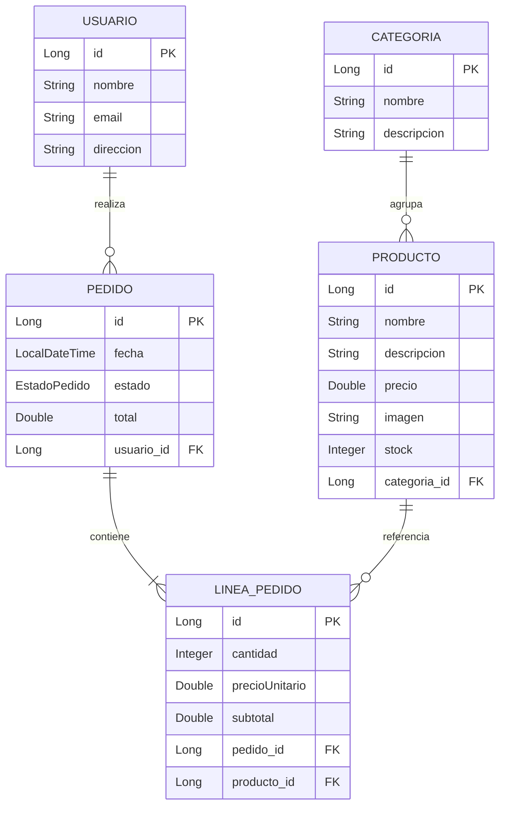

# TechLab E-commerce 🛒

Proyecto final del curso **Desarrollo Web Backend con Java + Spring Boot** (Talento Tech).

Sistema de e-commerce completo: API RESTful en Java con persistencia en MySQL, integrada con un frontend en React + Material UI.

🎥 Video del proyecto (etapa 1): https://youtu.be/VlGP8om9TMc

     

---

## Funcionalidades

- **Catálogo de productos** con búsqueda por nombre, imágenes, categorías y control de stock (CRUD completo).
- **Gestión de categorías** (CRUD).
- **Carrito de compras** persistente (localStorage) con edición de cantidades.
- **Pedidos**: creación con validación de stock, cálculo de total, snapshot de precios y descuento de stock **transaccional** (si una línea falla, no se descuenta nada).
- **Estados de pedido** con transiciones válidas: `PENDIENTE → CONFIRMADO → ENVIADO → ENTREGADO`, con cancelación (repone stock) desde PENDIENTE o CONFIRMADO.
- **Historial de pedidos por usuario**.
- **Panel de administración**: usuarios, ajuste rápido de stock con **alerta de stock bajo**, y cambio de estado de pedidos.
- **Manejo centralizado de errores** (`@RestControllerAdvice`) con excepciones personalizadas (`StockInsuficienteException`, `ResourceNotFoundException`, `EstadoInvalidoException`) y respuestas JSON uniformes.

## Arquitectura

```
proyecto_final2026/
├── src/main/java/com/techlab/      # Backend Spring Boot
│   ├── config/                     # CORS global
│   ├── controller/                 # Endpoints REST
│   ├── service/                    # Lógica de negocio (interfaces + impl)
│   ├── repository/                 # Spring Data JPA
│   ├── model/                      # Entidades JPA
│   ├── dto/                        # Cuerpos de request de pedidos
│   └── exception/                  # Excepciones + handler global
├── src/main/resources/
│   ├── application.properties
│   └── data.sql                    # Datos semilla (idempotente)
└── frontend/                       # React + Vite + Material UI
    └── src/
        ├── api/                    # Cliente axios + capa de llamadas
        ├── context/                # Carrito, usuario actual, notificaciones
        ├── components/             # Layout, cards, diálogos reutilizables
        ├── pages/                  # Una página por sección del menú
        └── utils/                  # Formato de precio/fecha
```

Lo generado por las herramientas no se versiona: `target/` (compilado de Maven), `frontend/node_modules/`, `frontend/dist/` y `frontend/.env`. Se recrean con `mvn` y `npm install`.

### Modelo de datos




## Cómo correr el proyecto

Hay dos caminos: con **Docker** (no requiere tener Java ni MySQL instalados) o **instalación manual**.

## Opción A: con Docker

Requiere solo Docker Desktop. Levanta la base de datos y el backend juntos:

```bash
cp .env.example .env
```

Poné una contraseña en `DB_PASSWORD` dentro de `.env` y después:

```bash
docker compose up --build
```

La API queda en `http://localhost:8080/api`, con las tablas creadas y los datos semilla cargados. El MySQL del contenedor se expone en el **3307**, no en el 3306, para no chocar con un MySQL que ya tengas instalado.

Comandos útiles:

| Comando | Qué hace |
|---|---|
| `docker compose up --build` | Construye las imágenes y levanta todo |
| `docker compose up -d` | Igual, pero en segundo plano |
| `docker compose logs -f backend` | Ver los logs del backend |
| `docker compose down` | Baja los contenedores (los datos se conservan) |
| `docker compose down -v` | Baja todo **y borra la base** |

El frontend no está en Docker: se corre aparte con `npm run dev` (paso 3 más abajo).

## Opción B: instalación manual

### Requisitos
- Java 17+ y Maven
- MySQL 8 corriendo en `localhost:3306`
- Node.js 20+

### 1. Base de datos

No hace falta crear la base a mano: la URL de conexión usa `createDatabaseIfNotExist=true`, así que el driver crea `techlab_db` en el primer arranque si no existe. Después Hibernate crea las tablas (`ddl-auto=update`) y `data.sql` carga los datos semilla.

Solo se necesita MySQL corriendo y un usuario con permiso de `CREATE`.

La conexión se configura con variables de entorno, que `src/main/resources/application.properties` lee al arrancar:

| Variable | Qué es |
|---|---|
| `DB_URL` | URL JDBC de la base (por defecto, `techlab_db` en MySQL local) |
| `DB_USERNAME` | Usuario de MySQL |
| `DB_PASSWORD` | Contraseña de ese usuario |

Definilas antes de levantar el backend, en vez de editar el archivo:

```bash
export DB_USERNAME=tu_usuario
export DB_PASSWORD=tu_password
```
### 2. Backend
```bash
mvn spring-boot:run
```
En el primer arranque se crea la base, las tablas y los datos semilla (categorías, productos y usuarios de prueba). API en `http://localhost:8080/api`.

### 3. Frontend
```bash
cd frontend
npm install
npm run dev
```
App en `http://localhost:5173`. La URL de la API se configura copiando `frontend/.env.example` a `frontend/.env` y ajustando `VITE_API_URL`.

## Endpoints principales

| Método | Ruta | Descripción |
|---|---|---|
| GET | `/api/productos?nombre=` | Listar / buscar productos |
| GET | `/api/productos/{id}` | Detalle de producto |
| POST | `/api/productos` | Crear producto |
| PUT | `/api/productos/{id}` | Actualizar producto |
| PATCH | `/api/productos/{id}/stock` | Ajustar stock |
| DELETE | `/api/productos/{id}` | Eliminar producto |
| GET | `/api/productos/stock-bajo?umbral=5` | Alerta de stock bajo |
| GET/POST/PUT/DELETE | `/api/categorias` | CRUD de categorías |
| GET/POST/PUT/DELETE | `/api/usuarios` | CRUD de usuarios |
| GET | `/api/usuarios/{id}/pedidos` | Historial de pedidos del usuario |
| GET | `/api/pedidos?usuarioId=` | Listar pedidos |
| POST | `/api/pedidos` | Crear pedido (valida y descuenta stock) |
| PUT | `/api/pedidos/{id}/estado` | Cambiar estado (valida transición) |

### Ejemplo: crear un pedido

```http
POST /api/pedidos
Content-Type: application/json

{
  "usuarioId": 1,
  "lineas": [
    { "productoId": 9, "cantidad": 2 },
    { "productoId": 7, "cantidad": 1 }
  ]
}
```

Si no hay stock suficiente, la API responde `400 Bad Request`:

```json
{
  "timestamp": "2026-07-12T00:59:00",
  "status": 400,
  "error": "Bad Request",
  "mensaje": "Stock insuficiente para 'Mouse Inalámbrico': solicitado 100, disponible 6"
}
```

## Decisiones de diseño

- **Sin autenticación**: fuera del alcance del curso; el frontend selecciona el "usuario actual" desde un selector. Con más tiempo se agregaría Spring Security + JWT.
- **El stock se descuenta al crear el pedido** (que es la confirmación del carrito) y se repone si se cancela.
- **`precioUnitario` snapshot en `LineaPedido`**: los cambios de precio futuros no alteran los pedidos históricos.
- **Carrito en el frontend** (localStorage): patrón habitual para usuarios no autenticados; el backend valida todo al confirmar.
- **Sin herencia de productos** (subclases tipo `Bebida`/`Comida`): se descartó conscientemente porque complica el mapeo JPA y el frontend sin aportar valor a este dominio.

## Mejoras futuras

- Autenticación con Spring Security + JWT
- Paginación y ordenamiento en los listados
- Tests unitarios y de integración
- Dockerización (compose con MySQL + backend + frontend)
